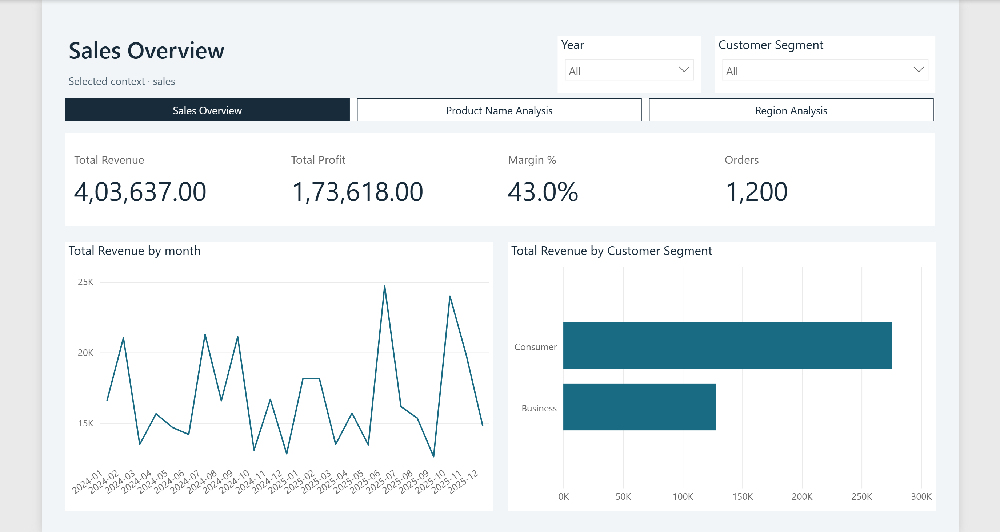

# Power BI Analyst and Builder

An installable agent skill by **Anandhu Vimalan** that studies your data, designs
the analytical experience around your business decisions, and builds an actual
Power BI project. It preserves the original advanced DAX, M and modeling guides.

**[Download the portable skill](https://github.com/Anandhuvimalan/powerbi-analyst-skill/releases/latest/download/powerbi-analyst.zip)**
· [Release notes](https://github.com/Anandhuvimalan/powerbi-analyst-skill/releases)
· [Agent workflow](docs/agent-skill.md)

## Use it with your AI agent

1. Download the release ZIP and extract its `powerbi-analyst` folder into your
   agent's skills directory, such as `~/.codex/skills/` or `~/.claude/skills/`.
2. Have the agent read `powerbi-analyst/SKILL.md`. Run its setup helper once:

   ```powershell
   python <path-to-skill>/scripts/agent.py setup
   ```

3. Provide your dataset and ask:

   > Use $powerbi-analyst to study this dataset and build a fresh Power BI project
   > for our business decisions. Design the model, measures, pages and visual
   > hierarchy from the analysis. Save the project and verify it where possible.

The host needs file access and command execution. Python 3.11+ and Node.js 20+
are required for full setup; Power BI Desktop on Windows is needed for live
refresh, DAX execution and rendered screenshots. A chat-only file upload cannot
modify your local Desktop. The ZIP bundles the executor source and pinned package
manifests; setup downloads Python and Microsoft dependencies into an isolated
environment. No paid model or API key is bundled.

## How this avoids a repeated dashboard

In skill-driven builds, the agent authors a source-backed analysis brief and both
model and report plans. `agent_mode: true` rejects missing plans and checks source
evidence, page decisions and duplicate analytical visuals. The report follows the
audience, grain and questions; there is no required page list, KPI row or chart
trio. Similar needs can justify similar visuals. Originality and analytical
quality still depend on the host agent's reasoning and review.

The direct CLI also retains a conservative bootstrap mode for connectivity tests
and simple examples. Running that alone is not the full agent workflow. The
original snippet workflow remains available when explicitly requested.

## Developer quick start and executable demo



This is one verification example. The skill directs the agent to author the
analytical experience for each user's project rather than reuse this report.

This repository now includes an executable **PBIP + TMDL + PBIR builder** beneath
the original analyst skill. The six original knowledge guides are preserved.
It writes actual semantic model and report files, with staged validation,
checkpoints, rollback, Microsoft MCP/CLI adapters and optional Desktop visual QA.

```powershell
python -m pip install -e ".[test]"
npm ci
python -m powerbi_agent doctor
python -m powerbi_agent build examples/sales-request.json
```

For the real Microsoft model executor:

```powershell
python -m powerbi_agent build examples/sales-request.json --modeling mcp
```

For the tested Windows Desktop workflow, including optional native data refresh
and live DAX comparisons:

```powershell
python -m powerbi_agent build examples/sales-desktop-request.json
```

This writes `output/AutonomousSales/AutonomousSales.pbip`. See setup for the
required secure local API preview and English-UI refresh fallback.

The included fictitious retail dataset produces a project under
`output/SalesAnalytics/`, with four tables, three relationships, ten measures and
four report pages. Page architecture changes with the data and business goal;
proven equivalent groupings are collapsed to avoid redundant analytical pages.

**Verification boundary:** file creation and offline TOM parsing do not execute M,
refresh data, evaluate DAX, or render charts. Install/open Power BI Desktop for
those checks. The build state records unverified runtime and visual checks
explicitly. The standalone default planner is conservative; the original AI skill
or a configured reasoning provider supplies advanced business-specific plans.

- [Setup, commands and Desktop requirements](docs/setup.md)
- [Architecture and plan contracts](docs/architecture.md)
- [Verified demo and capability coverage](docs/demo.md)
- [Original repository audit](docs/repository-audit.md)

## Original artifact workflow (preserved)

A reusable [Agent Skill](https://docs.claude.com/en/docs/claude-code/skills)
that makes an AI study source data **like a senior data analyst** and produce
production-ready Power BI artifacts — instead of blindly running a fixed
transformation template.

Give it a **CSV, Excel, JSON, a folder of files, or another tabular source**,
and it will study the data first, decide what each column actually needs, and
output:

- **Power Query (M)** — one paste-ready `.md` per table, with the exact source path
- **`relationships.tmdl.md`** — only the relationships real keys support
- **`measures.tmdl.md`** — only measures that answer a real business question
- **Visualization Blueprint** — step-by-step, every visual tied to a question
- **Data Quality & Governance Notes** + **Assumptions / Justifications**

## Philosophy

It behaves like a **Senior Enterprise Data Analyst and BI Consultant**, not a
rule-based engine. The reference files are a *toolkit, not a checklist*:

- Studies and classifies every column before any transformation.
- **Never auto-imputes** missing values — decides per column and justifies it.
- Treats outliers only when warranted; flags rather than deletes by default.
- Never forces a star schema or invents dimensions.
- Creates only meaningful measures and only valuable visuals.
- Explains why each technique was applied **and why others were skipped**.
- Avoids over-engineering and generic enterprise boilerplate.

All M and TMDL output is 100% copy-paste ready into Power BI Desktop (Advanced
Editor / TMDL files) with zero comments.

## Structure

```
powerbi-analyst/
├── SKILL.md                         # philosophy + workflow + hard output rules
└── references/
    ├── data-study.md                # column profiling & classification (phase 1)
    ├── power-query.md               # M connectors (CSV/Excel/JSON/folder), cleaning, imputation, outliers
    ├── tmdl-relationships.md        # relationship modeling
    ├── tmdl-measures.md             # DAX measures in TMDL
    ├── visualization-blueprint.md   # business-question-driven visuals
    └── governance.md                # right-sized governance + validation checklist
```

## Install

**Claude Code** — copy the skill into your skills directory:

```bash
# user-level (all projects)
cp -r powerbi-analyst ~/.claude/skills/

# or project-level
cp -r powerbi-analyst .claude/skills/
```

Then invoke it by asking, e.g. *"build a Power BI model from this CSV"*, or call
`/powerbi-analyst` directly.

## Usage

Provide the source file's **full local path** (required — it goes verbatim into
the M `Source` step). Optionally add business rules, reporting objectives, and
the target audience. Anything not provided is inferred from the data and noted
in the Assumptions section.

## License

MIT — see [LICENSE](LICENSE).
