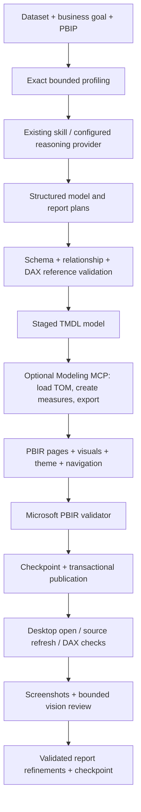

# Execution architecture

The original skill is the knowledge layer. Its six references remain unchanged.
The Python package adds execution underneath it; no original runtime was replaced
because the repository originally contained only prompts and reference Markdown.

## Modules and responsibilities

| Module | Responsibility |
|---|---|
| `analysis.py` | CSV/TSV/XLSX/JSON/SQLite/SQL Server readers, exact profiling, quality issues, role inference |
| `planning.py` | Conservative baseline model, proven relationships, functional-dependency entity extraction, date dimension, contextual DAX |
| `reasoning.py` | Original skill loading and configured AI planner protocol |
| `agent_workflow.py` | Agent-mode requirements, source-backed analysis briefs and page-decision traceability |
| `model.py` | Native M connectors, derived M queries, serialized TMDL tables, columns, measures, relationships, hierarchies, expressions, groups, roles |
| `report.py` | Dynamic page planning, visual bindings, grid geometry, human-readable labels, themes, slicers, drillthrough, native navigation |
| `adapters.py` | Protocol interfaces, installed Microsoft CLI discovery, MCP schema checking, Desktop bridge, Store install discovery |
| `validation.py` | Plan schemas, names/types/references, key evidence, filter graph ambiguity, layout, card sizing, theme contrast, CLI diagnostics |
| `runtime.py` | Independent source aggregation, filter/time-context test queries, live result comparison |
| `transaction.py` | File ownership, concurrent-build lock, drift checks, staging, ZIP/Git checkpoints, rollback and crash recovery |
| `qa.py` | Screenshot reviewer contract, score validation, patch restrictions, bounded refinement loop |
| `orchestrator.py` | State persistence, phased execution, publication and optional runtime/QA stages |
| `cli.py` | Build, plan, doctor, tool discovery, runtime verification and recovery |

## Planning versus execution

`plan` emits structured analysis and plans and explicitly says the project was not
changed. `build` validates and applies them to artifact folders, then publishes
the `.pbip`. The default planner runs without a language model, so it deliberately
limits semantic inference. Advanced reasoning comes from the original skill in
a host agent or `reasoning.command`; it can provide arbitrary justified M and DAX.

The model/report plans are the stable internal contract. Their JSON schemas are
under `powerbi_agent/schemas`. The executor is independent of any AI vendor and
Microsoft preview version. Only adapters know current tool names and payloads.

The installable skill uses `agent_mode:true`, which requires authored model/report
plans and an analysis brief (or a configured reasoning provider returning all
three). The brief is validated against source profiles and report page IDs.
Traceability and duplicate checks cannot guarantee originality; the host performs
the analytical and visual review. The legacy direct CLI bootstrap remains
available for connectivity testing and explicit simple builds.

MCP mode creates all model objects by loading staged TMDL with Microsoft's TOM,
then creates measures using `measure_operations` and exports canonical TMDL.
The verified server exposes other table, partition, relationship, hierarchy,
calculation-group, expression and RLS operations through the generic discovered
operation interface; these are not all separate hard-coded mutation workflows.
Offline connections support metadata authoring, not data refresh or DAX execution.

## Report authoring scope

The baseline selects cards, line/bar charts, tables, slicers and native page
navigation. Long date ranges use monthly rather than noisy daily trends. Page
count depends on relevant fields and requested analysis. Entity attributes with
proven identical groupings share one analytical cut; equal cardinality alone is
not treated as proof. Plans can select other
Microsoft-catalog visuals through exact role bindings and native formatting.
Schema validation catches unsupported roles/properties before publication.

Drillthrough fields include both filter and page binding definitions. Tooltip
pages can be authored by plans, with native visual tooltip bindings in
`container_objects`. Bookmark definitions, automatic bookmark-based experiences,
custom visuals, mobile layouts and composite-model migrations are not automated
by this first executor. These need explicit future adapters/authoring support.

## Transaction semantics

Generated paths are scoped to artifact folders beside the target PBIP. A manifest
records owned files and hashes. Hash mismatches before or during a build cancel
publication. A directory-level lock serializes builders. Staging contains only
the next generation, so parsing or authoring failure cannot damage the target.

Before publication, existing affected files are archived; Git creates an
independent checkpoint repository when available. The user's repository/index
is untouched. Publication uses atomic per-file replacement, with a durable
journal and whole-operation recovery. This is recoverable multi-file publication,
not a filesystem-wide atomic swap. On failure, the previous bytes and manifest
are restored. Retained checkpoints are not deleted automatically.

Existing unmanaged analytical projects are rejected as overwrite targets. This
avoids pretending that recreating a model preserves unseen measures, bookmarks,
relationships or Desktop edits. Build to a separate output or perform a reviewed
migration first.

## Evidence levels

1. **Plan/schema/static checks:** names, references, graph, geometry and JSON shape.
2. **Microsoft PBIR validation:** visual catalog and, when requested, remote JSON schemas.
3. **TOM round trip:** actual Microsoft parser loads and serializes the model.
4. **M refresh:** Power BI executes partitions with configured credentials.
5. **DAX verification:** matching model metadata, validated/executed queries,
   independent total/filter/time-context comparisons and execution metrics.
6. **Visual QA:** real screenshots inspected by a vision reviewer/host agent.

Each is recorded separately. Runtime refresh and visual proof are never inferred
from valid JSON or TMDL. Unknown result formats and blank screenshots fail closed
to review. Review scores are heuristic judgments, not Microsoft certification.

## Known production limits

- Baseline entity inference is conservative and name-assisted; custom business
  metrics and complicated grains require original-skill reasoning.
- Exact profiling is memory bounded by the configurable row limit, not a scalable
  distributed profiler. Large sources need database-side preparation.
- All generated native file models use Import mode. No silent DirectQuery/Direct
  Lake selection, gateway configuration, Fabric deployment or service publishing.
- SQL credentials stay outside artifacts. Credentials for Power BI refresh are
  configured through supported Power BI mechanisms, not embedded in M.
- Arbitrary custom DAX is structurally linted, but full syntax/semantics need a
  connected engine. Time/RLS/performance acceptance must reflect the business.
- Visual refinement applies validated title/geometry patches. Semantic redesign
  should run through a new full plan, not unrestricted screenshot-driven edits.
- Desktop data refresh uses an optional named accessibility command because the
  tested bridge exposes no refresh API. This Windows/English fallback is isolated
  from construction. Desktop XMLA refresh is rejected after a live timeout; use
  the native fallback or Desktop itself, then compare live DAX results.
